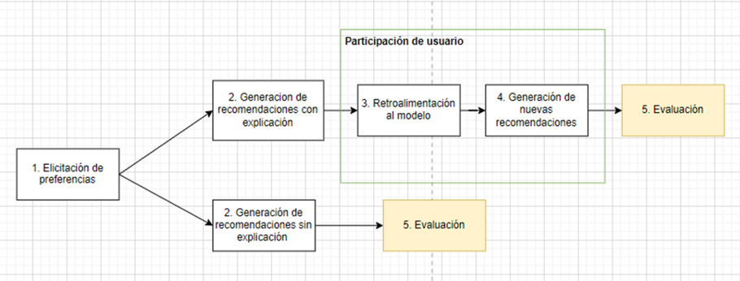
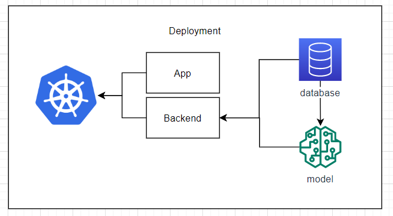
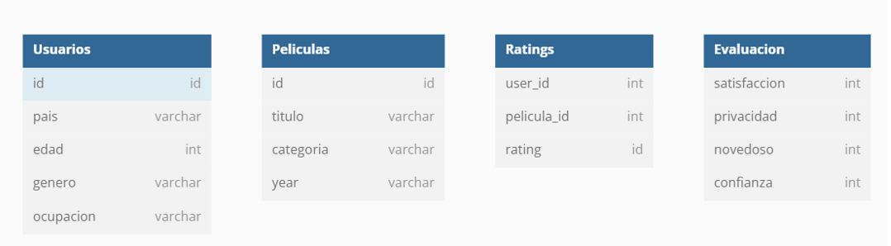
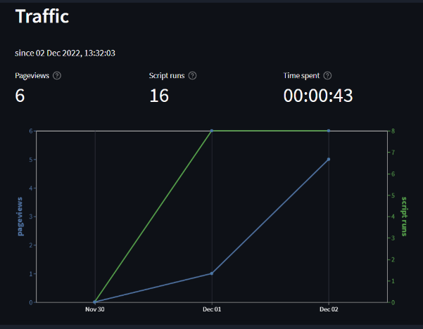
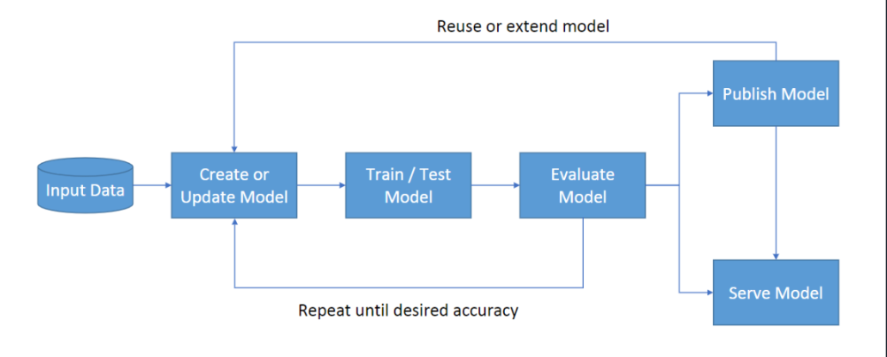

# Cloud-Proj: SISTEMAS DE  RECOMENDACIÓN CON  PARTICIPACIÓN DE USUARIO  Y EXPLICABILIDAD

Aplicación en StreamLit con un sistema de recomendación de películas, que utiliza las opiniones de los usuarios para mejorar continuamente sus recomendaciones.

[Link de la aplicación](https://flrotm-recomendacion-experimento-app-a17wtd.streamlit.app/?analytics=on)

## Integrantes

- Francesco Uccelli
- Esteban Villacorta


## Deployment

```
kubectl apply -f kubernetes\app-deployment.yaml
kubectl apply -f kubernetes\app-service.yaml
kubectl get svc project
```

Si esta usando minikube como cluster, puede utilizar el siguiente comando para conseguir el url:

```
minikube service project
```

## Objetivos de la aplicación

- Comprobar si la participación del usuario y la explicabilidad incrementa las métricas de éxito de un sistema de recomendación hibrido. 
- Medir el efecto de la recopilación de datos antes de generar las recomendaciones (elicitacion de preferencias).
- Utilizar la retroalimentación como método principal de participación de usuario para un sistema de recomendación. 

## Características

El sistema de recomendación funciona de acuerdo al siguiente diagrama, que permite la retroalimentación de preferencias del usuario:



1.	Elicitación de preferencias: Durante la elicitación de preferencias el usuario brinda información personal (o se ingresa automáticamente a través de la herramienta). Por otro lado, en la elicitación de preferencias implícitas, el usuario le da rating a 10 películas que haya visto. (Se mostrarán y tendrá la opción de saltar las que no ha visto).
2.	Generación de recomendaciones: En esta fase del experimento se exponen los ítems generados con el modelo en base a la información explicita e implícita que proporcionó el usuario. En la secuencia superior (con participación) se muestran breves explicaciones sobre cómo se generaron los ítems. 
3.	Retroalimentación al modelo: El usuario tiene la opción de calificar las recomendaciones, de tal manera que el modelo recibe el feedback y lo guarda para el siguiente paso.
4.	Generación de nuevas recomendaciones: En base a la información previa y la retroalimentación del usuario, se generan nuevos ítems de recomendación y se exponen al usuario para la evaluación.
5.	Evaluación: Ambas veces se evalúa la lista de ítems finales según las métricas de éxito: satisfacción, confianza, privacidad y novedad. 


### Requerimientos funcionales

- Un usuario debe completar ambos caminos. Hace el A y luego el B.
- El usuario puede llenar el formulario con sus datos
- Se le muestran 10 películas al usuario para que les asigne un rating y un orden
- El usuario recibe la lista de ítems recomendados
- El usuario puede evaluar los ítems en base a las métricas de éxito
- Para el camino A, se generan un nuevo conjunto de ítems nuevo
- El usuario puede evaluar el segundo conjunto de ítems

### Requerimientos no funcionales

- Maximizar la probabilidad de que el usuario haya visto las películas que se le pide evaluar
- Las recomendaciones se generan en menos de 7 segundos
- Se puede observar las imágenes de “cartelera” de las películas.
- El usuario puede evaluar todas sus recomendaciones en conjunto

## Arquitectura

### Aplicación


### Base de datos



# Presentación Final 

## Concepto 1 : Monitoreo
- Estadisticas del sistema - Resource usage
- Estadisticas de la aplicación - Performance y responsiveness.
- Estadisicas de uso - Preferencias de usuario y tracking de acciones.

### Estadísticas de tráfico


## Concepto 2 : MLOps

- Unión de Machine learning y la práctica de desarrollo de software y DevOps
- Sistemas de recomendación y MLOps
- Algunos conceptos fueron implementados pero no el 100%
- El entrenamiento se realizó de manera local
- Evaluación en NCF_model.ipynb
- Se publicó el modelo y llevo acabo el muetreo

### Lifecycle de un proyecto con MLOps



